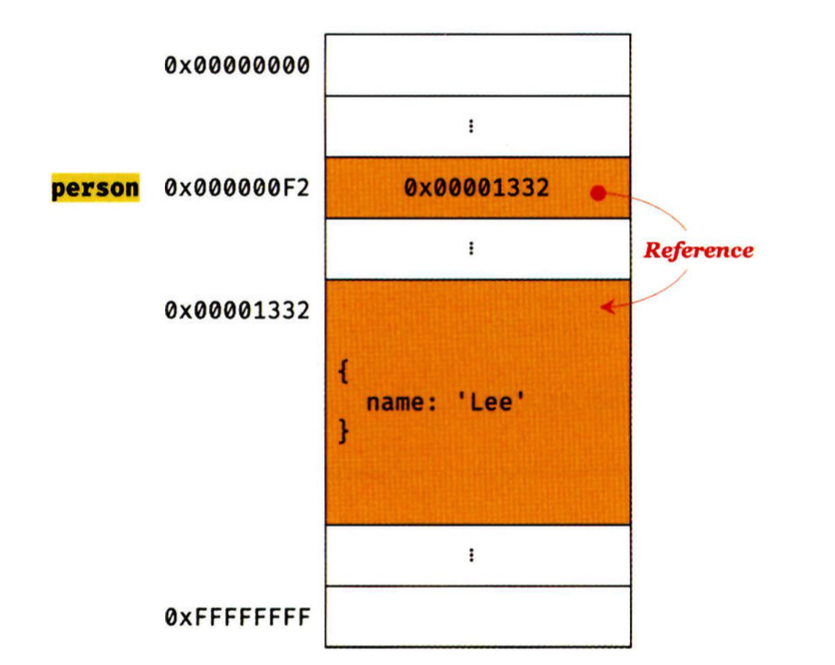

# 언제까지 넘겨 짚을래 ch11. 원시 값과 객체의 비교

|                  | 원시 타입의 값                | 객체 타입의 값                      |
| ---------------- | ----------------------------- | ----------------------------------- |
| 변경             | 불가능                        | 가능                                |
| 변수에 할당      | 변수에 실제 값 저장           | 변수에 참조 값 저장                 |
| 다른 변수에 할당 | 값에 의한 전달(pass by value) | 참조에 의한 전달(pass by reference) |

### ✏️ 원시 값

- 변경 불가능한 값
  🪝 **변수:** 하나의 값을 저장하기 위해 확보한 메모리 공간 자체나 그 메모리 공간
  🪝 **값**: 변수에 저장된 데이터로 표현식이 평가되어 생성된 결과
  원시 값은 변경 불가능하다 ⇒ 원시 값 자체를 변경할 수 없는 것이지 변수 값은 변경할 수 있다.

  ```jsx
  const animal = {};

  animal.name = 'gaori';
  console.log(animal); // {name: 'gaori'}

  animal.name = 'coco';
  console.log(animal); // {name: 'coco'}
  ```

- 문자열과 불변성
  ```jsx
  let temp = 'hi';
  temp = 'hello';
  temp[0] = 'H';
  console.log(temp); // hello
  ```
  자바스크립트의 문자열은 원시 타입이며 변경 불가능하다. 첫 번째 문장을 실행하면 temp는 “hi”라는 문자열을 가리키는 것이고 두 번째 문장을 실행하면 temp는 “hello”라는 문자열을 가리키는 것 뿐이다.
- 값에 의한 전달

  ```jsx
  let data = 50;
  let copy = data;

  console.log(data, copy); // 50 50

  data = 10;
  console.log(data, copy); // 10 50
  ```

  copy 변수에 data 변수의 값(50)이 복사되어 할당된다. 중요한 것은 data 변수와 copy 변수의 값은 서로 다른 메모리 공간에 저장되는데 쉽게 말해서 data 변수의 값을 변경해도 copy 변수에 영향을 주지 않는다.
  두 변수의 원시 값은 서로 다른 메모리 공간에 저장된 변개의 값이기에 한쪽에서 재할당을 한다 해도 서로 간섭할 수 없다.
  🪝**값에 의한 전달**: 식별자는 값이 아닌 메모리 주소를 기억하고 있기 때문에 변수에는 값이 전달되는 것이 아니라 메모리 주소가 전달된다.

### ✏️ 객체

- 변경 가능한 값
  
  재할당 없이 프로퍼티를 동적으로 추가할 수도 프로퍼티 값을 갱신할수도 프로퍼티 자체를 삭제할수도 있고 여러 개의 식별자가 하나의 객체를 공유할 수 있다.
  <br />
  🪝 **얕은 복사(shallow copy) & 깊은 복사(deep copy)**
  얕은 복사는 객체에 중첩된 객체의 경우 참조 값을 복사하고 깊은 복사는 중첩된 객체까지 모두 복사해서 원시값처럼 완전한 복사본을 만든다. (원시 값을 할당한 변수를 다른 변수에 할당하는 것을 깊은 복사, 객체를 할당한 변수를 다른 변수에 할당하는 것을 얕은 복사라고 부를수도 있다.)

  ```jsx
  const temp = 10;
  // 깊은 복사
  const deepCopy = temp;
  console.log(deepCopy === temp); // true

  // 얇은 복사
  const tempObject = { a: 1 };
  const shallowCopy = tempObject;
  console.log(shallowCopy === tempObject); // true
  ```

- 참조에 의한 전달

  ```jsx
  const animal = {
    name: 'gaori',
  };
  const copy = animal;
  console.log(copy === animal); // true

  copy.name = 'coco';
  animal.age = 5;
  console.log(animal); // {name: 'coco', age: 5}
  console.log(copy); // {name: 'coco', age: 5}
  ```
